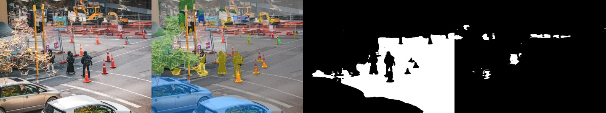
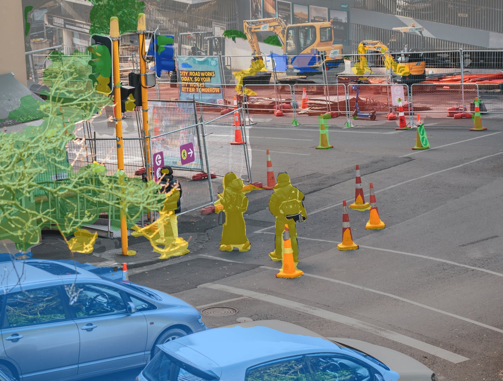

# Competiton Semantic Segmentation: SegFormer Branch

ROS 2 Jazzy perception branch for testing **SegFormer** as an alternative semantic segmentation backend on ZED X camera images.

This branch is intentionally separate from `main`. The stable `main` branch uses YOLOPv2 for drivable/lane masks plus Roboflow YOLOv8 for cones and objects. This branch keeps that working pipeline available, but makes SegFormer the front-page experiment so the two branches can be compared clearly.

> Repository name intentionally follows the requested spelling: `Competiton_Semantic_Segmentation`.

## Branch Purpose

| Question | Answer |
|---|---|
| Is SegFormer ROS-compatible here? | Yes. `segformer_node` subscribes to ROS images and publishes ROS masks, overlays, labels, metadata, and timing. |
| Is SegFormer replacing YOLOPv2? | No. This branch is for comparison only. |
| Does SegFormer detect traffic cones? | No. The Cityscapes SegFormer model does not have a traffic-cone class. |
| Does SegFormer detect lane lines? | No direct lane-line class in the Cityscapes model. |
| What might SegFormer improve? | Road/sidewalk/general scene semantic understanding for future semantic costmap work. |
| Should this be merged as default? | Not until ZED X validation proves it is better for the actual robot task. |

## SegFormer Architecture

```text
ZED X image topic
  /zed/zed_node/rgb/color/rect/image
        |
        v
segformer_node
  nvidia/segformer-b0-finetuned-cityscapes-512-1024
        |
        v
ROS 2 outputs
  /seg_ros/segformer/class_mask
  /seg_ros/segformer/road_mask
  /seg_ros/segformer/sidewalk_mask
  /seg_ros/segformer/overlay_image
  /seg_ros/segformer/label_info
  /seg_ros/segformer/metadata
  /seg_ros/segformer/timing
```

## SegFormer Proof

The proof below uses the same road/cone source image used by the `main` branch, but renders the SegFormer Cityscapes semantic output instead.

```text
input image | SegFormer semantic overlay | road mask | sidewalk mask
```



Single SegFormer overlay:



## Measured Smoke Test

SegFormer was tested by publishing the saved road/cone image as a ROS `sensor_msgs/msg/Image` and reading `/seg_ros/segformer/metadata`.

```text
model: nvidia/segformer-b0-finetuned-cityscapes-512-1024
input: proof/source_images/road_cars_cones_input.jpg
road pixels: 669,873
sidewalk pixels: 33,905
top classes: road, fence, car, building, vegetation, person
CPU inference time: about 963 ms/frame
```

For comparison, the current `main` branch live YOLOPv2 + Roboflow smoke test on the same source image reported:

```text
traffic cones detected: 8
people detected: 2
cars detected: 1
segmentation detections: 2
CPU inference time: about 630 ms/frame
```

Interpretation:

- SegFormer gives a useful `road` semantic mask.
- SegFormer is slower on CPU in this local test.
- SegFormer does not replace cone detection or lane-line masks.
- The current YOLOPv2 + Roboflow pipeline is still more complete for the competition task.

## Model Comparison

| Capability | Main branch: YOLOPv2 + Roboflow | This branch: SegFormer Cityscapes |
|---|---|---|
| ZED X ROS image input | yes | yes |
| road/drivable mask | yes, YOLOPv2 drivable mask | yes, Cityscapes `road` class |
| sidewalk mask | no dedicated output | yes |
| lane-line mask | yes | no |
| traffic-cone detection | yes, Roboflow YOLOv8 | no |
| people/cars/signs | bounding boxes from detector | semantic classes only |
| output style | masks + object boxes | semantic class masks |
| CPU smoke-test speed | about 630 ms/frame | about 963 ms/frame |
| best use | competition prototype now | research / semantic costmap comparison |

## ROS Compatibility

The SegFormer branch remains a ROS 2 Jazzy Python package:

```text
package: seg_ros_bridge
build type: ament_python
image conversion: cv_bridge
input type: sensor_msgs/msg/Image
mask outputs: sensor_msgs/msg/Image
label metadata: vision_msgs/msg/LabelInfo
debug metadata: std_msgs/msg/String JSON
```

The branch builds with:

```bash
cd /home/alexander/Desktop/Competiton_Semantic_Segmentation/ros2_ws
source /opt/ros/jazzy/setup.bash
colcon build --packages-select seg_ros_bridge
source install/setup.bash
```

## Install Optional SegFormer Dependency

SegFormer support uses Hugging Face `transformers`. It is optional so the stable pipeline does not depend on it.

```bash
/home/alexander/github/av-perception/.venv/bin/python -m pip install -r requirements-segformer.txt
```

The local venv was tested with `transformers` installed.

## Run SegFormer On ZED X

Start the ZED ROS 2 wrapper first, then confirm the camera topic:

```bash
ros2 topic list | grep zed
```

Default topic used by this branch:

```text
/zed/zed_node/rgb/color/rect/image
```

Older fallback topic:

```text
/zed/zed_node/rgb/image_rect_color
```

Launch SegFormer:

```bash
source /opt/ros/jazzy/setup.bash
source /home/alexander/Desktop/Competiton_Semantic_Segmentation/ros2_ws/install/setup.bash

ros2 launch seg_ros_bridge segformer.launch.py \
  image_topic:=/zed/zed_node/rgb/color/rect/image \
  model_id:=nvidia/segformer-b0-finetuned-cityscapes-512-1024 \
  device:=cpu \
  process_every_n:=1
```

Verify:

```bash
ros2 topic list | grep '^/seg_ros/segformer'
ros2 topic echo /seg_ros/segformer/metadata --once
ros2 topic echo /seg_ros/segformer/timing --once
```

## SegFormer Topics

| Topic | Type | Payload |
|---|---|---|
| `/seg_ros/segformer/input_image` | `sensor_msgs/msg/Image` | `bgr8` source frame |
| `/seg_ros/segformer/overlay_image` | `sensor_msgs/msg/Image` | semantic overlay |
| `/seg_ros/segformer/class_mask` | `sensor_msgs/msg/Image` | raw Cityscapes class-id mask |
| `/seg_ros/segformer/road_mask` | `sensor_msgs/msg/Image` | binary `road` class mask |
| `/seg_ros/segformer/sidewalk_mask` | `sensor_msgs/msg/Image` | binary `sidewalk` class mask |
| `/seg_ros/segformer/label_info` | `vision_msgs/msg/LabelInfo` | full model label map |
| `/seg_ros/segformer/metadata` | `std_msgs/msg/String` | class pixel counts and timing |
| `/seg_ros/segformer/timing` | `std_msgs/msg/String` | runtime timing |

Example metadata:

```json
{
  "model_id": "nvidia/segformer-b0-finetuned-cityscapes-512-1024",
  "road_pixels": 669873,
  "sidewalk_pixels": 33905,
  "class_pixel_counts": {
    "road": 669873,
    "car": 303233,
    "person": 87369
  },
  "timing_ms": 963.48
}
```

## What Remains From Main

The existing YOLOPv2 + Roboflow nodes are still present so this branch can run side-by-side comparisons:

| Node | Purpose |
|---|---|
| `live_perception_node` | current YOLOPv2 road/lane + Roboflow object pipeline |
| `segformer_node` | SegFormer semantic comparison pipeline |
| `zed_image_recorder_node` | records ZED X validation frames |
| `competition_objects_node` | static object proof runner |
| `seg_demo_node` | static YOLOPv2 road/lane proof runner |

Run the current main-style live pipeline:

```bash
ros2 launch seg_ros_bridge live_perception.launch.py \
  image_topic:=/zed/zed_node/rgb/color/rect/image \
  device:=cpu
```

Run SegFormer at the same time with frame skipping if CPU is overloaded:

```bash
ros2 launch seg_ros_bridge segformer.launch.py \
  image_topic:=/zed/zed_node/rgb/color/rect/image \
  device:=cpu \
  process_every_n:=3
```

## Decision Criteria

Use the same ZED X frames for both branches and compare:

1. road mask quality
2. sidewalk/non-road rejection
3. lane-line usefulness
4. traffic-cone support
5. CPU/GPU runtime
6. usefulness for Nav2 costmap work

Do not choose SegFormer only because it is newer. Choose it only if it improves the robot task.

## Current Opinion

SegFormer is ROS-compatible and useful for experimentation, especially for road/sidewalk semantic masks.

It is not currently better as the default model because:

- no lane-line class
- no traffic-cone class
- slower CPU smoke test
- no ZED X ground-truth IoU yet

Best use for this branch:

```text
compare SegFormer road/sidewalk masks against YOLOPv2 drivable masks on real ZED X frames
```

## Related Docs

- [SegFormer Experiment](docs/segformer_experiment.md)
- [ZED X Validation Workflow](docs/zed_validation_workflow.md)
- [Technical Architecture](docs/technical_architecture.md)
- [Dataset and Training Notes](docs/datasets_and_training.md)
- [Model Weights](models/README.md)
