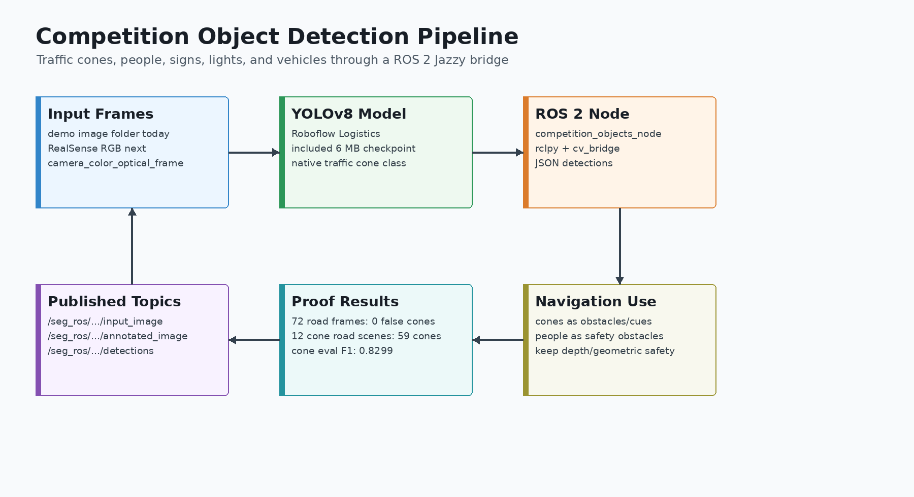

# Competiton Semantic Segmentation

ROS 2 road-line, drivable-area, and traffic-cone perception pipeline for the AVROS competition stack.

This repository contains a working ROS 2 bridge around a pretrained YOLOPv2 driving-perception model and a YOLOv8 traffic-cone/object detector. The current branch publishes lane-line masks, drivable-area masks, overlay images, traffic cone detections, and JSON detection topics.

> Repository name intentionally follows the requested spelling: `Competiton_Semantic_Segmentation`.

## Visual Pipeline


Combined road segmentation and cone detection proof from the current pretrained models:


Original road/lane segmentation proof:


Competition object detection pipeline:



Traffic cone detection proof:


Combined semantic segmentation plus traffic cone proof:


## Verified ROS 2 Compatibility

Verified locally on:

- Ubuntu with ROS 2 Jazzy installed at `/opt/ros/jazzy`
- `rclpy`
- `sensor_msgs`
- `std_msgs`
- `cv_bridge`
- `vision_msgs`
- Python 3.12 runtime with PyTorch installed
- pretrained YOLOPv2 TorchScript checkpoint
- included Roboflow Logistics YOLOv8 checkpoint for competition objects

Validation already run:

```bash
source /opt/ros/jazzy/setup.bash
cd ros2_ws
colcon build --packages-select seg_ros_bridge
```

Result:

```text
Finished <<< seg_ros_bridge
Summary: 1 package finished
```

Python syntax validation:

```bash
/home/alexander/github/av-perception/.venv/bin/python -m py_compile \
  scripts/export_roadline_proof.py \
  scripts/evaluate_traffic_cones.py \
  scripts/generate_competition_objects_diagram.py \
  scripts/generate_pipeline_diagram.py \
  ros2_ws/src/seg_ros_bridge/seg_ros_bridge/competition_objects_node.py \
  ros2_ws/src/seg_ros_bridge/seg_ros_bridge/seg_demo_node.py
```

## What This Publishes

| Topic | Type | Notes |
|---|---|---|
| `/seg_ros/input_image` | `sensor_msgs/msg/Image` | Source image |
| `/seg_ros/overlay_image` | `sensor_msgs/msg/Image` | Debug overlay with drivable area, lanes, and detections |
| `/seg_ros/drivable_mask` | `sensor_msgs/msg/Image` | `mono8`, 0 background, 255 drivable area |
| `/seg_ros/lane_mask` | `sensor_msgs/msg/Image` | `mono8`, 0 background, 255 lane marking |
| `/seg_ros/lane_confidence` | `sensor_msgs/msg/Image` | `mono8`, current lane confidence proxy |
| `/seg_ros/label_info` | `vision_msgs/msg/LabelInfo` | Transient-local class metadata |
| `/seg_ros/detections` | `std_msgs/msg/String` | JSON detection boxes from YOLOPv2 |

Current label map:

| ID | Class |
|---:|---|
| 0 | `background` |
| 1 | `drivable_area` |
| 2 | `lane_marking` |

The combined proof sheet uses the same layout as the original segmentation proof:

```text
original road frame | road/lane + cone overlay | drivable mask | lane mask
```

## Competition Object Detection

This branch adds a ROS 2 object detector for competition-relevant objects using an included Roboflow Logistics YOLOv8 checkpoint:

```text
models/roboflow_logistics_yolov8.pt
```

Useful model classes:

```text
person
traffic cone
traffic light
road sign
car
truck
van
```

ROS 2 node:

```text
competition_objects_node
```

Published topics:

| Topic | Type | Notes |
|---|---|---|
| `/seg_ros/competition_objects/input_image` | `sensor_msgs/msg/Image` | Source image |
| `/seg_ros/competition_objects/annotated_image` | `sensor_msgs/msg/Image` | Detection overlay |
| `/seg_ros/competition_objects/detections` | `std_msgs/msg/String` | JSON object detections |

Traffic cone proof:

```text
proof/combined/semantic_segmentation_plus_cones_contact_sheet.jpg
proof/combined/semantic_segmentation_plus_cones_road.jpg
proof/traffic_cones/actual_road_cone_contact_sheet.jpg
proof/traffic_cones/traffic_cone_eval_contact_sheet.jpg
proof/traffic_cones/traffic_cone_eval.json
```

Traffic cone evaluation summary:

```text
annotation-based cone evaluation:
  images: 48
  ground-truth cones: 167
  predicted cones: 168
  precision: 0.8274
  recall: 0.8323
  F1: 0.8299

actual road test:
  non-cone road frames: 72
  cone false positives: 0
  selected road-cone scenes: 12
  detected cones: 59
```

## Repository Layout

```text
.
├── docs/
│   ├── competition_objects_pipeline.png
│   ├── ros2_semantic_segmentation_pipeline.png
│   ├── semantic_roadlines_pipeline.md
│   └── traffic_cones/
├── models/
│   ├── README.md
│   └── roboflow_logistics_yolov8.pt
├── proof/
│   ├── combined/
│   ├── contact_sheet.jpg
│   ├── traffic_cones/
│   └── exported proof overlays and masks
├── ros2_ws/
│   └── src/
│       └── seg_ros_bridge/
└── scripts/
    ├── evaluate_traffic_cones.py
    ├── export_roadline_proof.py
    ├── generate_competition_objects_diagram.py
    └── generate_pipeline_diagram.py
```

## Model Weights

The pretrained model checkpoint is intentionally not committed because it is about 150 MB.

Expected local path:

```text
/home/alexander/Desktop/seg/data/weights/yolopv2.pt
```

Upstream release:

```text
https://github.com/CAIC-AD/YOLOPv2/releases/download/V0.0.1/yolopv2.pt
```

See [models/README.md](models/README.md) for weight notes.

## Build the ROS 2 Package

```bash
cd /home/alexander/Desktop/Competiton_Semantic_Segmentation/ros2_ws
source /opt/ros/jazzy/setup.bash
colcon build --packages-select seg_ros_bridge
```

Optional environment check:

```bash
source /opt/ros/jazzy/setup.bash
ros2 pkg prefix rclpy
ros2 pkg prefix cv_bridge
ros2 pkg prefix vision_msgs
```

## Run the Demo Publisher

This command runs the pretrained model over demo images and publishes ROS 2 topics.

```bash
source /opt/ros/jazzy/setup.bash
cd /home/alexander/Desktop/seg
/home/alexander/github/av-perception/.venv/bin/python \
  /home/alexander/Desktop/Competiton_Semantic_Segmentation/ros2_ws/src/seg_ros_bridge/seg_ros_bridge/seg_demo_node.py \
  --ros-args \
  -p project_root:=/home/alexander/Desktop/seg \
  -p image_dir:=/home/alexander/Desktop/seg/data/demo \
  -p weights_path:=/home/alexander/Desktop/seg/data/weights/yolopv2.pt \
  -p device:=cpu \
  -p publish_rate_hz:=0.5
```

The direct Python command is currently the most reliable runtime path because the Torch-enabled virtual environment is separate from the system ROS 2 Python installation.

## Run the Competition Object Detector

Use the launch file:

```bash
source /opt/ros/jazzy/setup.bash
cd /home/alexander/Desktop/Competiton_Semantic_Segmentation/ros2_ws
ros2 launch seg_ros_bridge competition_objects.launch.py
```

Or run the node directly with the Torch/Ultralytics Python runtime:

```bash
source /opt/ros/jazzy/setup.bash
/home/alexander/github/av-perception/.venv/bin/python \
  /home/alexander/Desktop/Competiton_Semantic_Segmentation/ros2_ws/src/seg_ros_bridge/seg_ros_bridge/competition_objects_node.py \
  --ros-args \
  -p image_dir:=/home/alexander/Desktop/Competiton_Semantic_Segmentation/proof/traffic_cones/raw_road_inputs \
  -p model_path:=/home/alexander/Desktop/Competiton_Semantic_Segmentation/models/roboflow_logistics_yolov8.pt \
  -p device:=cpu \
  -p confidence:=0.35
```

Verify object topics:

```bash
source /opt/ros/jazzy/setup.bash
ros2 topic list | grep '^/seg_ros/competition_objects'
ros2 topic echo /seg_ros/competition_objects/detections --once
```

## Verify Runtime Topics

Open another terminal:

```bash
source /opt/ros/jazzy/setup.bash
ros2 topic list | grep '^/seg_ros/'
ros2 topic echo /seg_ros/label_info --once
ros2 topic echo /seg_ros/lane_mask --once
```

Expected topic list:

```text
/seg_ros/detections
/seg_ros/drivable_mask
/seg_ros/input_image
/seg_ros/label_info
/seg_ros/lane_confidence
/seg_ros/lane_mask
/seg_ros/overlay_image
```

## Export Proof Images

```bash
cd /home/alexander/Desktop/Competiton_Semantic_Segmentation
/home/alexander/github/av-perception/.venv/bin/python \
  scripts/export_roadline_proof.py \
  --project-root /home/alexander/Desktop/seg \
  --weights /home/alexander/Desktop/seg/data/weights/yolopv2.pt \
  --source-dir /home/alexander/Desktop/seg/data/demo \
  --output-dir /home/alexander/Desktop/roadline_demo_proof \
  --limit 6 \
  --device cpu
```

Observed proof counts:

```text
all2.jpg: lane_pixels=22216 drivable_pixels=342950
all3.jpg: lane_pixels=30512 drivable_pixels=252702
fs1.jpg: lane_pixels=29901 drivable_pixels=284413
fs2.jpg: lane_pixels=20362 drivable_pixels=168026
fs3.jpg: lane_pixels=2759 drivable_pixels=145975
lane1.jpg: lane_pixels=15326 drivable_pixels=73835
```

## ROS 2 Integration Notes

- The current nodes are reproducible image-folder publishers for proving the pretrained road segmentation and cone/object detection pipeline.
- The next runtime node should subscribe to `/camera/camera/color/image_raw` from the RealSense stack.
- Lane markings should be treated as navigation cues, not physical obstacles.
- Traffic cones and people should be treated as obstacle/safety cues.
- Drivable-area masks can later feed a Nav2 semantic costmap layer.
- Geometric obstacle layers should remain enabled for safety.

## Next Steps

1. Add a live image subscriber for `/camera/camera/color/image_raw`.
2. Keep the current image-folder publisher for repeatable demos.
3. Add ONNX/TensorRT export for Jetson deployment.
4. Compare YOLOPv2 against TwinLiteNetPlus on the same RealSense frames.
5. Feed drivable-area masks into the Nav2 semantic costmap integration.
