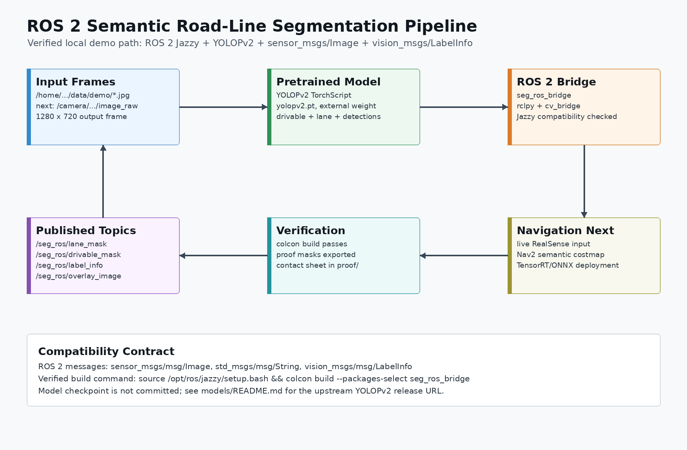
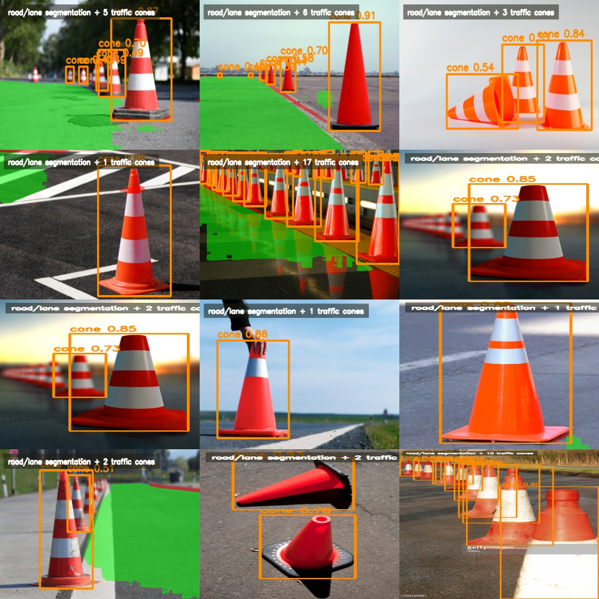
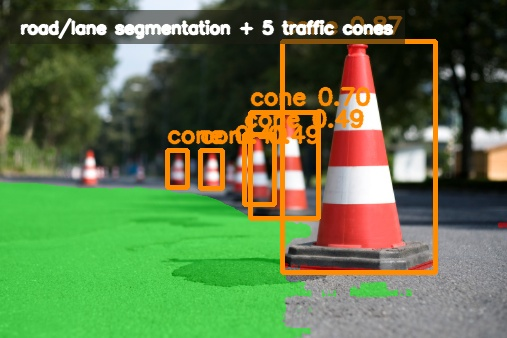
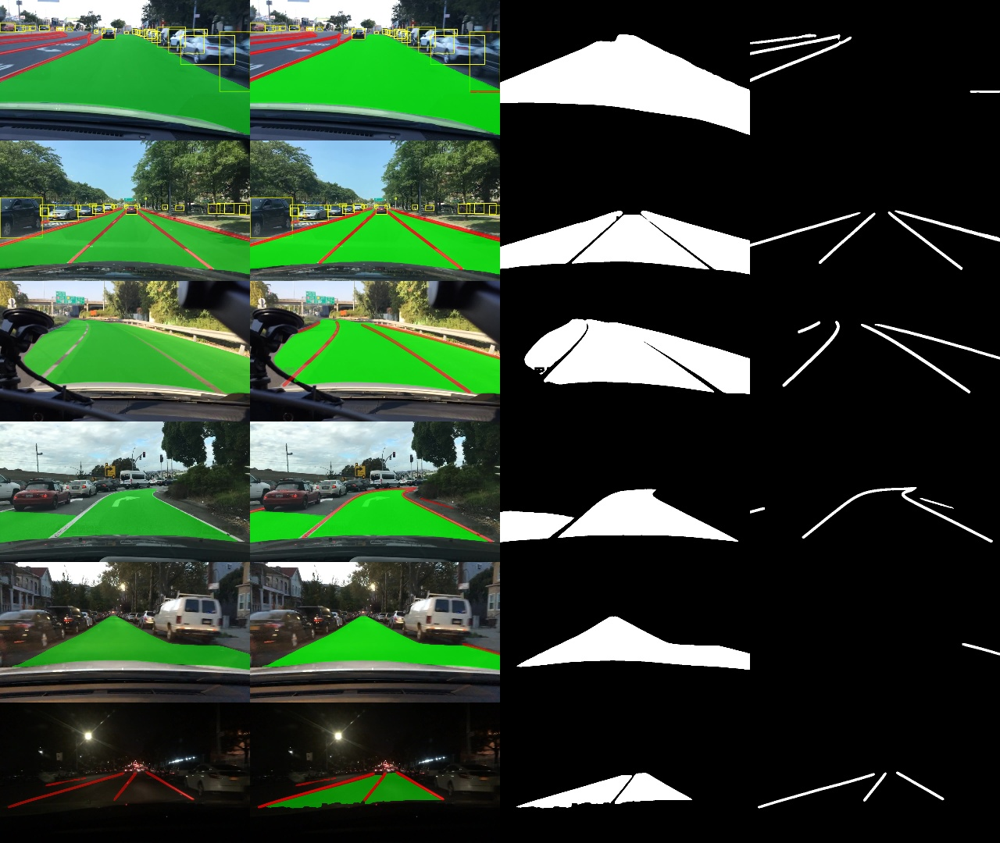
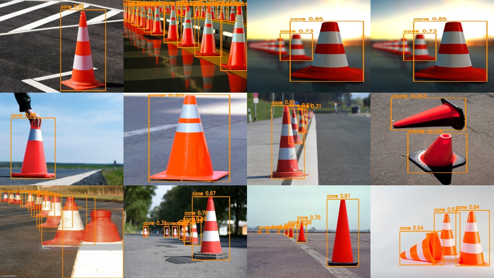

# Competiton Semantic Segmentation

ROS 2 Jazzy perception stack for semantic road segmentation, lane-line masks, and traffic-cone/object detection.

This repository wraps pretrained perception models in a project-owned ROS 2 package. It supports repeatable static-image proofs and a live ZED X image subscriber. The current implementation is accurate enough for prototype perception testing, but it is not yet a certified driving safety system.

> Repository name intentionally follows the requested spelling: `Competiton_Semantic_Segmentation`.

## Status

| Area | Current state |
|---|---|
| Road/drivable segmentation | Working from pretrained YOLOPv2 checkpoint |
| Lane-line segmentation | Working from pretrained YOLOPv2 checkpoint |
| Traffic-cone detection | Working from included Roboflow Logistics YOLOv8 checkpoint |
| People / vehicle / sign detection | Supported by the included object detector |
| Live camera path | Implemented for ZED X ROS 2 image topics |
| SegFormer comparison | Optional experimental backend on a separate topic namespace |
| ROS 2 package | Builds with `colcon` on ROS 2 Jazzy |
| Nav2 semantic costmap | Planned, not claimed complete |
| Local custom training | Not done yet; dataset plan documented |

## System Architecture



```text
ZED X / image folder
  -> ROS 2 image input
  -> YOLOPv2 road + lane segmentation
  -> Roboflow Logistics YOLOv8 object detection
  -> masks, overlays, label metadata, detections, timing
  -> future Nav2 / obstacle-fusion integration
```

| Component | Implementation |
|---|---|
| ROS package | `seg_ros_bridge`, Python `ament_python` |
| Live input | `/zed/zed_node/rgb/color/rect/image` by default |
| Image conversion | `cv_bridge`, OpenCV BGR frames |
| Road/lane model | YOLOPv2 TorchScript checkpoint loaded with PyTorch |
| Object model | Roboflow Logistics YOLOv8 checkpoint loaded with Ultralytics |
| Mask outputs | `sensor_msgs/msg/Image`, `mono8` |
| Debug overlays | `sensor_msgs/msg/Image`, `bgr8` |
| Label metadata | `vision_msgs/msg/LabelInfo` |
| Detections | JSON in `std_msgs/msg/String` |

## Proof

**Combined road segmentation and traffic-cone detection**

```text
input road image | semantic road/lane + cone overlay | drivable mask | lane mask
```



**Single combined overlay**



**Original road/lane segmentation baseline**



**Traffic cone evaluation proof**



## Measured Results

Traffic-cone detector, measured on the local labeled cone dataset:

```text
images tested: 48
ground-truth cones: 167
predicted cones: 168
precision: 0.8274
recall: 0.8323
F1: 0.8299
confidence threshold: 0.25
IoU match threshold: 0.50
```

Live ROS subscriber smoke test, using the saved combined road/cone proof image published as a ROS image:

```text
traffic cones detected: 8
people detected: 2
cars detected: 1
segmentation detections: 2
CPU inference time: about 630 ms/frame
```

SegFormer comparison smoke test on the same saved image:

```text
model: nvidia/segformer-b0-finetuned-cityscapes-512-1024
road pixels: 669,873
sidewalk pixels: 33,905
top classes: road, fence, car, building, vegetation, person
CPU inference time: about 963 ms/frame
```

Road/lane segmentation is functionally validated by non-empty masks and proof images. Numeric road/lane IoU is not reported yet because project-owned ground-truth road/lane masks for the ZED X camera have not been labeled.

## Models

| Model | Task | Dataset / source | In repo? |
|---|---|---|---|
| YOLOPv2 | drivable area, lane-line masks, driving-scene detections | Upstream YOLOPv2 checkpoint, documented around BDD100K-style driving perception | No, external checkpoint |
| Roboflow Logistics YOLOv8 | traffic cones, people, signs, vehicles, logistics objects | Roboflow Logistics dataset, 99,238 images, 20 classes, reported 76% mAP | Yes |
| SegFormer B0 Cityscapes | optional road/sidewalk semantic comparison | Hugging Face `nvidia/segformer-b0-finetuned-cityscapes-512-1024` | No, downloaded by `transformers` |

Included checkpoint:

```text
models/roboflow_logistics_yolov8.pt
```

Expected external YOLOPv2 checkpoint:

```text
/home/alexander/Desktop/seg/data/weights/yolopv2.pt
```

Detailed model and dataset notes:

- [Dataset and Training Notes](docs/datasets_and_training.md)
- [Technical Architecture](docs/technical_architecture.md)
- [SegFormer Experiment](docs/segformer_experiment.md)
- [ZED X Validation Workflow](docs/zed_validation_workflow.md)
- [Model Weights](models/README.md)
- [Traffic Cone Detection Notes](docs/traffic_cones/README.md)

## ROS Nodes

| Node | Input | Output |
|---|---|---|
| `seg_demo_node` | static road images | road/lane masks, overlay, label info, YOLOPv2 detections |
| `competition_objects_node` | static object-demo images | annotated image, object detection JSON |
| `live_perception_node` | ROS image topic | live road/lane masks, combined overlay, label info, object detections, timing |
| `segformer_node` | ROS image topic | optional Cityscapes semantic masks for comparison |
| `zed_image_recorder_node` | ZED X ROS image topic | saved validation frames and `manifest.json` |

## ROS Topics

Live perception topics:

| Topic | Type | Payload |
|---|---|---|
| `/seg_ros/live/input_image` | `sensor_msgs/msg/Image` | `bgr8` source frame |
| `/seg_ros/live/overlay_image` | `sensor_msgs/msg/Image` | `bgr8` road/lane overlay plus object boxes |
| `/seg_ros/live/drivable_mask` | `sensor_msgs/msg/Image` | `mono8`, 0 background, 255 drivable |
| `/seg_ros/live/lane_mask` | `sensor_msgs/msg/Image` | `mono8`, 0 background, 255 lane marking |
| `/seg_ros/live/lane_confidence` | `sensor_msgs/msg/Image` | `mono8` confidence proxy |
| `/seg_ros/live/label_info` | `vision_msgs/msg/LabelInfo` | transient-local class map |
| `/seg_ros/live/detections` | `std_msgs/msg/String` | combined JSON detections |
| `/seg_ros/live/timing` | `std_msgs/msg/String` | runtime timing JSON |

Static proof topics remain available under `/seg_ros/*` and `/seg_ros/competition_objects/*`.

SegFormer comparison topics are published under `/seg_ros/segformer/*`.

Semantic class map:

| ID | Class |
|---:|---|
| 0 | `background` |
| 1 | `drivable_area` |
| 2 | `lane_marking` |

Object allow-list:

```text
person
traffic cone
traffic light
road sign
car
truck
van
```

Example live detection payload:

```json
{
  "header": {
    "stamp": {
      "sec": 0,
      "nanosec": 0
    },
    "frame_id": "camera_color_optical_frame"
  },
  "segmentation_detections": {
    "count": 0,
    "detections": []
  },
  "competition_objects": {
    "count": 1,
    "detections": [
      {
        "type": "traffic_cone",
        "class_name": "traffic cone",
        "confidence": 0.87,
        "xyxy": [248.0, 315.0, 302.0, 417.0]
      }
    ]
  },
  "timing_ms": 215.4
}
```

Bounding boxes use image-pixel `xyxy` format:

```text
[x_min, y_min, x_max, y_max]
```

## Build

```bash
cd /home/alexander/Desktop/Competiton_Semantic_Segmentation/ros2_ws
source /opt/ros/jazzy/setup.bash
colcon build --packages-select seg_ros_bridge
source install/setup.bash
```

## Run

Live ZED X perception:

```bash
source /opt/ros/jazzy/setup.bash
source /home/alexander/Desktop/Competiton_Semantic_Segmentation/ros2_ws/install/setup.bash
ros2 launch seg_ros_bridge live_perception.launch.py \
  image_topic:=/zed/zed_node/rgb/color/rect/image \
  device:=cpu \
  process_every_n:=1
```

Older ZED ROS 2 setups may publish rectified RGB on:

```text
/zed/zed_node/rgb/image_rect_color
```

Check the available camera topics:

```bash
ros2 topic list | grep zed
```

Static road/lane proof:

```bash
source /opt/ros/jazzy/setup.bash
cd /home/alexander/Desktop/seg
/home/alexander/github/av-perception/.venv/bin/python \
  /home/alexander/Desktop/Competiton_Semantic_Segmentation/ros2_ws/src/seg_ros_bridge/seg_ros_bridge/seg_demo_node.py \
  --ros-args \
  -p project_root:=/home/alexander/Desktop/seg \
  -p image_dir:=/home/alexander/Desktop/seg/data/demo \
  -p weights_path:=/home/alexander/Desktop/seg/data/weights/yolopv2.pt \
  -p device:=cpu
```

Static object detector proof:

```bash
source /opt/ros/jazzy/setup.bash
source /home/alexander/Desktop/Competiton_Semantic_Segmentation/ros2_ws/install/setup.bash
ros2 launch seg_ros_bridge competition_objects.launch.py
```

Optional SegFormer comparison:

```bash
/home/alexander/github/av-perception/.venv/bin/python -m pip install -r requirements-segformer.txt

source /opt/ros/jazzy/setup.bash
source /home/alexander/Desktop/Competiton_Semantic_Segmentation/ros2_ws/install/setup.bash
ros2 launch seg_ros_bridge segformer.launch.py \
  image_topic:=/zed/zed_node/rgb/color/rect/image \
  model_id:=nvidia/segformer-b0-finetuned-cityscapes-512-1024 \
  device:=cpu
```

Verify live output:

```bash
ros2 topic list | grep '^/seg_ros/'
ros2 topic echo /seg_ros/live/detections --once
ros2 topic echo /seg_ros/live/timing --once
```

## Reproduce Evaluations

Traffic-cone evaluation:

```bash
/home/alexander/github/av-perception/.venv/bin/python \
  scripts/evaluate_traffic_cones.py \
  --model models/roboflow_logistics_yolov8.pt \
  --dataset /home/alexander/Desktop/HERE_Object_Anomaly/cone_test/cone_dataset \
  --output-dir proof/traffic_cones \
  --device cpu \
  --conf 0.25 \
  --iou 0.50
```

Combined semantic road + cone proof:

```bash
/home/alexander/github/av-perception/.venv/bin/python \
  scripts/generate_combined_semantic_cone_proof.py
```

Record ZED X validation frames:

```bash
source /opt/ros/jazzy/setup.bash
source /home/alexander/Desktop/Competiton_Semantic_Segmentation/ros2_ws/install/setup.bash
ros2 launch seg_ros_bridge zed_image_recorder.launch.py \
  image_topic:=/zed/zed_node/rgb/color/rect/image \
  output_dir:=/home/alexander/Desktop/Competiton_Semantic_Segmentation/validation/zed_frames \
  max_frames:=200 \
  save_every_n:=5
```

Benchmark current models on an image folder:

```bash
/home/alexander/github/av-perception/.venv/bin/python \
  scripts/benchmark_live_perception.py \
  --image-dir validation/zed_frames \
  --output-json validation/benchmark_report.json \
  --device cpu \
  --limit 200
```

## Project Layout

```text
docs/
  datasets_and_training.md
  segformer_experiment.md
  semantic_roadlines_pipeline.md
  technical_architecture.md
  traffic_cones/README.md
  zed_validation_workflow.md
models/
  roboflow_logistics_yolov8.pt
proof/
  combined/
  source_images/
  traffic_cones/
ros2_ws/src/seg_ros_bridge/
scripts/
  benchmark_live_perception.py
  extract_validation_frames.py
requirements-segformer.txt
```

## Limitations

- The road/lane model is an upstream pretrained checkpoint, not a locally fine-tuned competition model.
- The cone detector measured about 83% F1 on the available labeled cone dataset, which is useful but not safety-grade.
- Live ZED X field reliability still needs to be measured on actual robot video.
- Road/lane IoU cannot be reported until ZED X road/lane masks are labeled.
- 2D cone/person detections should not become physical obstacles until fused with ZED depth, point cloud, lidar, or another geometric source.
- Lane-line masks should be treated as navigation cues, not collision truth.

## Next Steps

1. Run `live_perception_node` against the physical ZED X camera on the robot.
2. Record 100-200 ZED X frames with road, lane markings, cones, people, and anomalies.
3. Label cone boxes plus drivable-road and lane-line masks.
4. Report cone F1 and road/lane IoU on that ZED X validation set.
5. Add typed `vision_msgs/msg/Detection2DArray` output beside the existing JSON debug output.
6. Fuse detections with depth/point cloud before Nav2 costmap integration.
